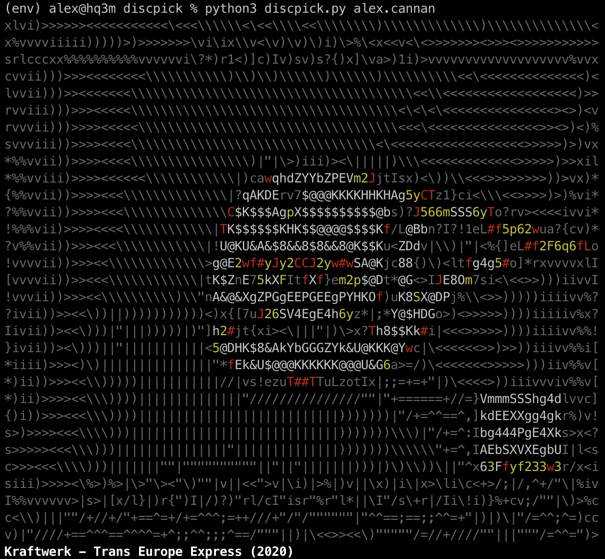

# discpick

This is a simple CLI tool to pick a random album from your discogs collection.

## Setup

```bash
python3 -m pip install -r requirements.txt
export DISCOGS_USER_TOKEN="your_user_token"
```

Note: to generate a discogs user token, go to https://www.discogs.com/settings/developers.

## Usage

```bash
python3 discpick.py $username
```



## Note

Right now the color palette is quite limited, I'd like to include a wider range soon. In the meantime, I suggest squinting.